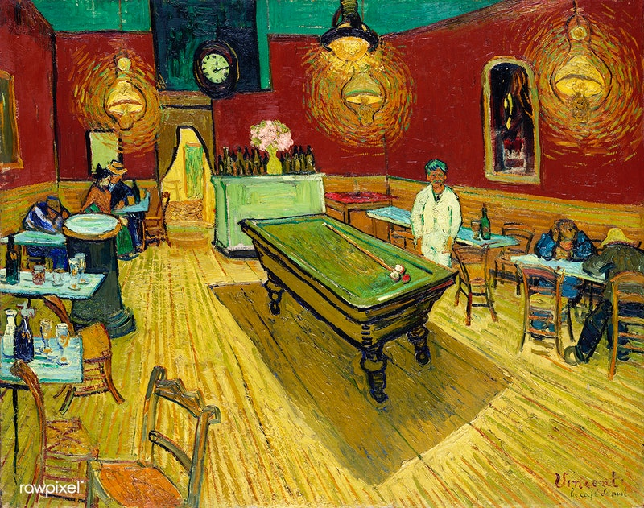
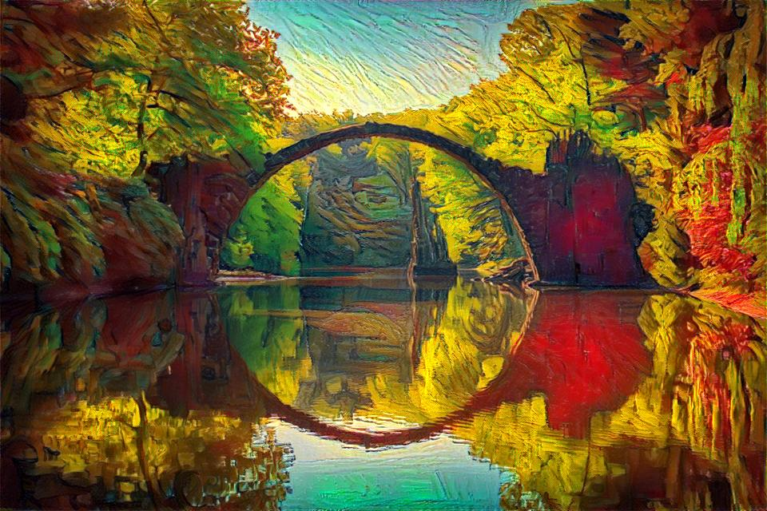
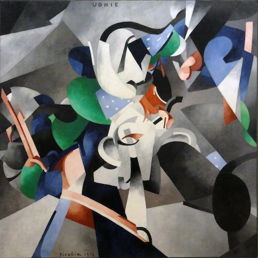
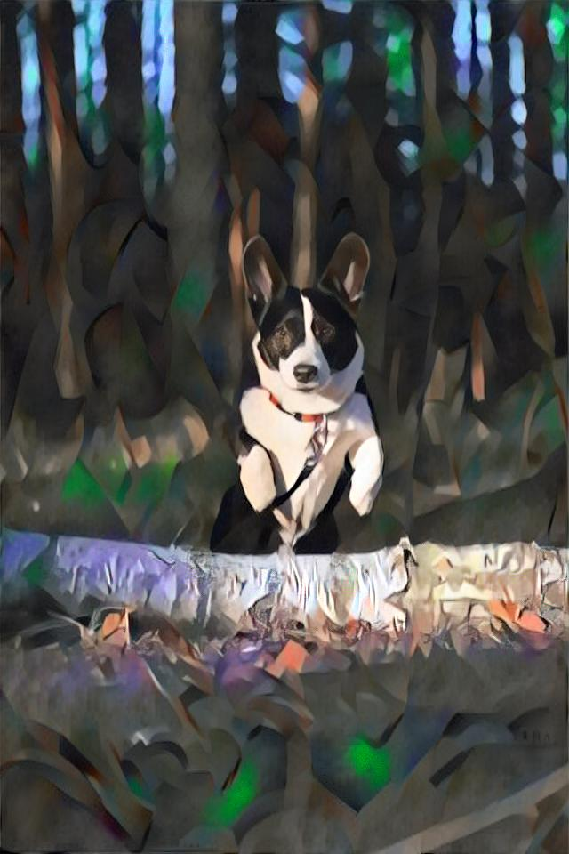

# 🧠 Neural Style Transfer

Este proyecto es una implementación modular de **Neural Style Transfer** (NST) desarrollado en **Python**, que permite aplicar estilos artísticos tanto en **imágenes** como en **videos**, utilizando redes neuronales convolucionales (CNN) basadas en el modelo **VGG19**.

---
## 🎯 Objetivo

Explorar y entender el funcionamiento de las redes convolucionales aplicadas al arte, analizando cómo diferentes combinaciones de capas afectan la transferencia de estilo y permitiendo experimentar con diversos niveles de agresividad estilística.

---
## 📸 Ejemplos de Resultados

Imagen: green_bridge.jpg + the_night_cafe.jpg:
<div style="display: flex; gap: 10px;">
    
    
</div>

---



<div style="display: flex; gap: 10px;">
    
    
</div>



---
## 🧱 Estructura del Proyecto

```plaintext
Neural_style_transfer/
│
├── config/                   # Archivos YAML para configurar estilos y contenidos
│   ├── img_config/
│   ├── grid_video_config/
│   └── config_idea
│
├── img_content/              # Imágenes base (contenido)
├── styles/                   # Imágenes artísticas (estilo)
├── img_results/              # Resultados de imagen
│
├── video_content/            # Videos de entrada
├── video_results/            # Resultados de video
│   ├── content_frames/
│   └── transferred_frames/
│
├── src/                      # Código fuente principal
│   ├── image_style_transfer.py
│   ├── video_style_transfer.py
│   ├── video_style_transfer_in_medias_res.py
│   ├── train_model.py
│   └── utils.py
│
├── scripts/                  # Utilidades auxiliares
│   ├── cuda.py
│   └── img_size.py
│
├── grid_search.py            # Búsqueda de mejores combinaciones de capas
├── main.py                   # Script principal
└── README.md

```
---
## 🧪 ¿Cómo Funciona?

El sistema fusiona una imagen de contenido con una imagen de estilo, optimizando una imagen de salida para minimizar:
- **Pérdida de contenido** entre la imagen generada y la imagen base.
- **Pérdida de estilo** entre la imagen generada y la imagen de estilo.

Se basa en el paper original de *Leon Gatys et al.* pero con múltiples configuraciones personalizables desde YAML para experimentar con distintas capas de contenido y estilo.

---
## ⚙️ Tecnologías Usadas
- 🐍 Python
- 🔬 [PyTorch](https://pytorch.org/) (modelo VGG19 preentrenado)
- 📊 Scikit-learn (para análisis y selección de combinaciones)
- 📁 YAML (para configuración de capas y estilos)
- 📷 OpenCV (procesamiento de imágenes y video)

---
## 🎨 Tipos de Estilo

El proyecto permite probar diferentes **combinaciones de capas** para lograr distintos efectos:

| Tipo de Estilo | Descripción |
|---|---|
| 🔵 **Subtle (Estilo Ligero)** | Conserva la estructura, añade texturas finas. Ideal para contenido reconocible. |
| 🟠 **Moderado** | Balance entre contenido y estilo. Similar al paper original. |
| 🔴 **Agresivo / Abstracto** | El estilo domina completamente. Ideal para arte experimental. |
| 🟢 **Texturas Finas** | Captura pinceladas y patrones. Útil para estilos como acuarela o pastel. |
| 🟣 **Estructura Global** | Captura composición global del estilo. Mejora resultados con paisajes. |

---
## 🧠 Conclusiones y Observaciones
- **Estilo Abstracto** funciona bien con pocas épocas, pero puede ser demasiado agresivo para estructuras delicadas.
- **Métodos `std`, `subtle`, `text`** funcionan bien salvo en modo rápido (`fast`), que tiende a distorsionar.
- **Global** capta mejor los estilos con trazos marcados, pero puede ser muy sutil con estilos suaves.
- La selección de capas influye drásticamente en el resultado visual: el *contenido* controla la estructura, el *estilo* determina la textura y color.
- Diferencias entre `fast` y `slow` afectan la intensidad y fidelidad del estilo aplicado.

---
## 📦 Ejecución Rápida
```bash
# Clona el repositorio
git clone [https://github.com/DavidY343/Neural_style_transfer.git](https://github.com/DavidY343/Neural_style_transfer.git)
cd Neural_style_transfer

# Instala dependencias
pip install -r requirements.txt

# Ejecuta una transferencia de estilo y modifica el json del archivo main.py
python main.py 
# Puedes configurar fácilmente los estilos, imágenes y parámetros en los archivos YAML incluidos en /config.

```


Video: happy_heidi_cow_short_25fps.mp4 + pawel.jpg → happy_heidi_cow_short_25fps-pawel.mp4

## 🔍 Exploración Avanzada
También se incluye un script de búsqueda de combinaciones (grid_search.py) para experimentar con distintas capas y pesos de contenido/estilo, tanto en imágenes como en videos.

## ✍️ Autor
Este proyecto fue desarrollado como una forma de entender el funcionamiento de las redes convolucionales (CNNs) mediante un enfoque artístico y experimental. Combina procesamiento visual con investigación técnica de modelos y capas.

