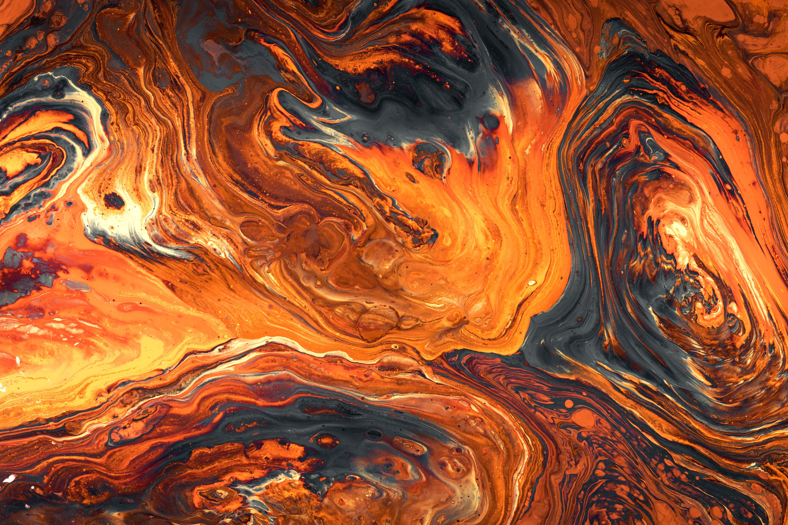

# 🧠 Neural Style Transfer

This project is a modular implementation of Neural Style Transfer (NST) developed in Python, enabling the application of artistic styles to both images and videos using convolutional neural networks (CNN) based on the VGG19 model.
---
## 🎯 Objetive

To explore and understand the functioning of convolutional networks applied to art, analyzing how different layer combinations affect style transfer and enabling experimentation with various levels of stylistic intensity.
---
## 📸 Ejemplos de Resultados

<!-- Ejemplo 1 -->
Imagen: green_bridge.jpg + the_night_cafe.jpg:
<div style="display: flex; flex-direction: column; align-items: center; margin-bottom: 30px;">
    <!-- Contenido + Estilo -->
    <div style="display: flex; justify-content: center; gap: 10px;">
        
        
    </div>
    <!-- Resultado -->
    <div style="margin-top: 15px; display: flex; justify-content: center;">
        
    </div>
</div>

<!-- Ejemplo Video -->
Video: happy_heidi_cow_short_25fps.mp4 + pawel.jpg:
<div style="display: flex; flex-direction: column; align-items: center; margin-bottom: 30px;">
    <!-- Contenido (GIF preview del video) + Estilo -->
    <div style="display: flex; justify-content: center; gap: 10px;">
        
        
    </div>
    <!-- Resultado -->
    <div style="margin-top: 15px; display: flex; justify-content: center;">
        
    </div>
</div>


---
## 🧱 Project Structure

```plaintext
Neural_style_transfer/
│
├── config/                   # YAML files for configuring styles and content
│   ├── img_config/
│   ├── grid_video_config/
│   └── config_idea
│
├── img_content/              # Base images (content)
├── styles/                   # Artistic images (style)
├── img_results/              # Image results
│
├── video_content/            # Input videos
├── video_results/            # Video results
│   ├── content_frames/
│   └── transferred_frames/
│
├── src/                      # Main source code
│   ├── image_style_transfer.py
│   ├── video_style_transfer.py
│   ├── video_style_transfer_in_medias_res.py
│   ├── train_model.py
│   └── utils.py
│
├── scripts/                  # Helper utilities
│   ├── cuda.py
│   └── img_size.py
│
├── grid_search.py            # Search for optimal layer combinations
├── main.py                   # Main script
├── requirements.txt          # Python dependencies
└── README.md

```
---
## 🧪 How It Works

The system fuses a content image with a style image, optimizing an output image to minimize:
- **Content loss** between the generated image and the base content image..
- **Style loss** between the generated image and the style image.

It is based on the original paper by Leon Gatys et al. but includes multiple customizable configurations via YAML, allowing experimentation with different content and style layers.

---
## ⚙️ Technologies Used
- 🐍 Python
- 🔬 [PyTorch](https://pytorch.org/)  (pre-trained VGG19 model)
- 📊 Scikit-learn (for analysis and combination selection)
- 📁 YAML (for analysis and combination selection)
- 📷 OpenCV (for analysis and combination selection)

---
## 🎨 Tipos de Estilo

The project allows testing different layer combinations to achieve distinct effects:

| Style Type | Description |
|---|---|
| 🔵 **Subtle** | 	Preserves structure, adds fine textures. Ideal for recognizable content. |
| 🟠 **Moderate** | Balanced between content and style. Similar to the original paper. |
| 🔴 **Aggressive / Abstract** | 	Style fully dominates. Best for experimental art. |
| 🟢 **Fine Textures** | Captures brushstrokes and patterns. Great for watercolor or pastel styles. |
| 🟣 **Glboal Structure** | Captures the overall composition of the style. Works well with landscapes. |

---
## 🧠 Conclusions and Observations
- **Abstract Style** works well with fewer epochs but can be overly aggressive for delicate structures.
- **Methods `std`, `subtle`, `text`**  methods perform well except in fast mode, which tends to distort.
- **Global** captures styles with strong strokes better but may be too subtle with soft styles.
- Layer selection drastically impacts visual results: content controls structure, style defines texture and color.
- ifferences between ``fast`` and ``slow`` affect the intensity and fidelity of the applied style.

---
## 📦 Ejecución Rápida
```bash
# Clone the repository
git clone [https://github.com/DavidY343/Neural_style_transfer.git](https://github.com/DavidY343/Neural_style_transfer.git)
cd Neural_style_transfer

# Install dependencies
pip install -r requirements.txt

# Run a style transfer and adjust the JSON in main.py
python main.py
# You can easily configure styles, images, and parameters via the YAML files in /config.


```

## 🔍 Advanced Exploration
A grid search script (grid_search.py) is also included to experiment with different layer and content/style weight combinations for both images and videos.

## ✍️ Author
This project was developed as a way to understand the workings of convolutional neural networks (CNNs) through an artistic and experimental approach, combining visual processing with technical research on models and layers.
